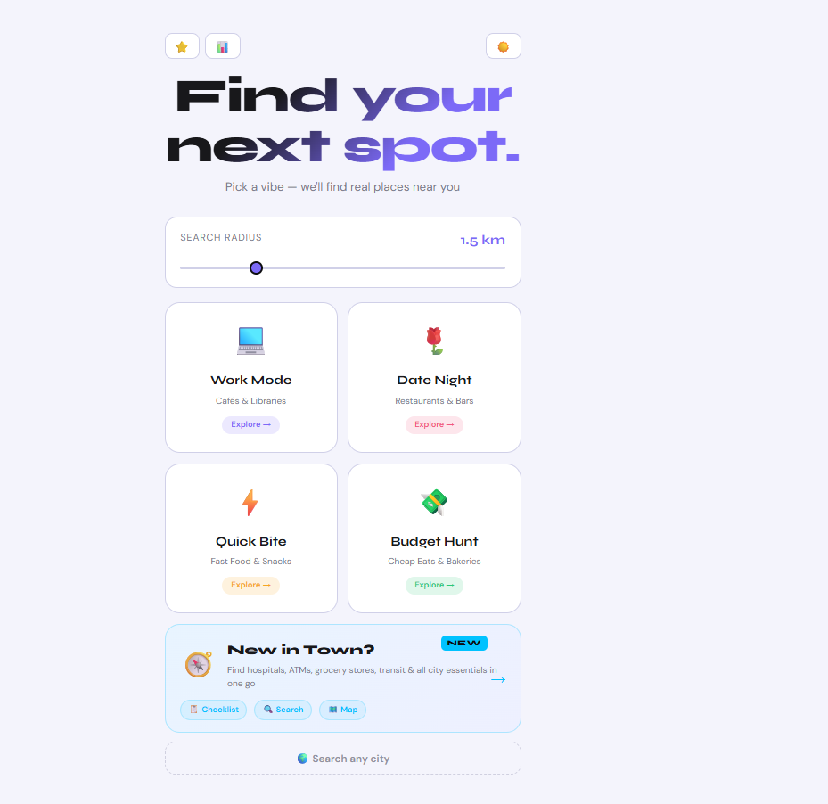
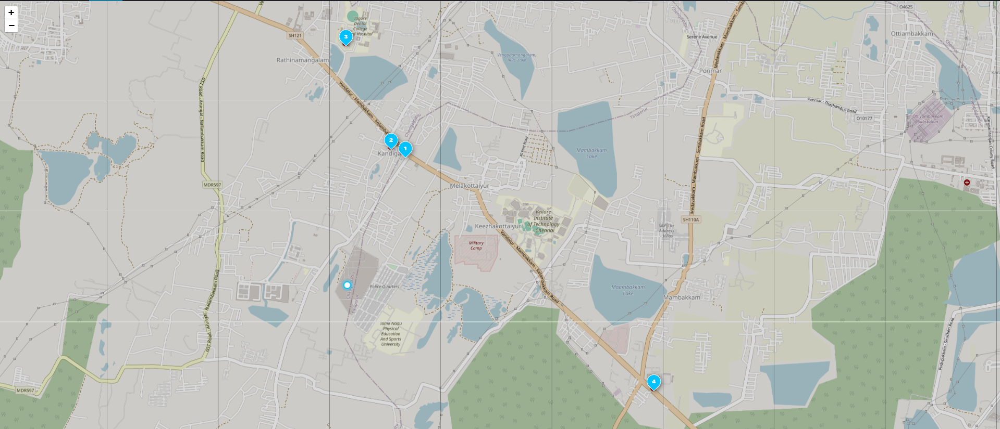
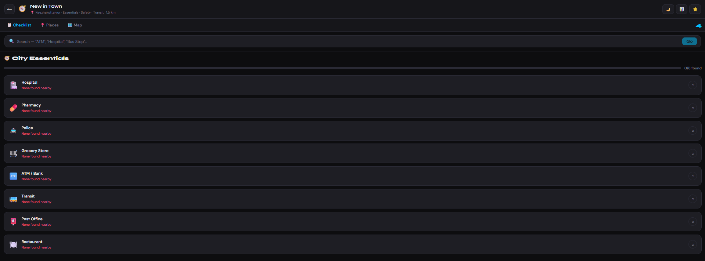
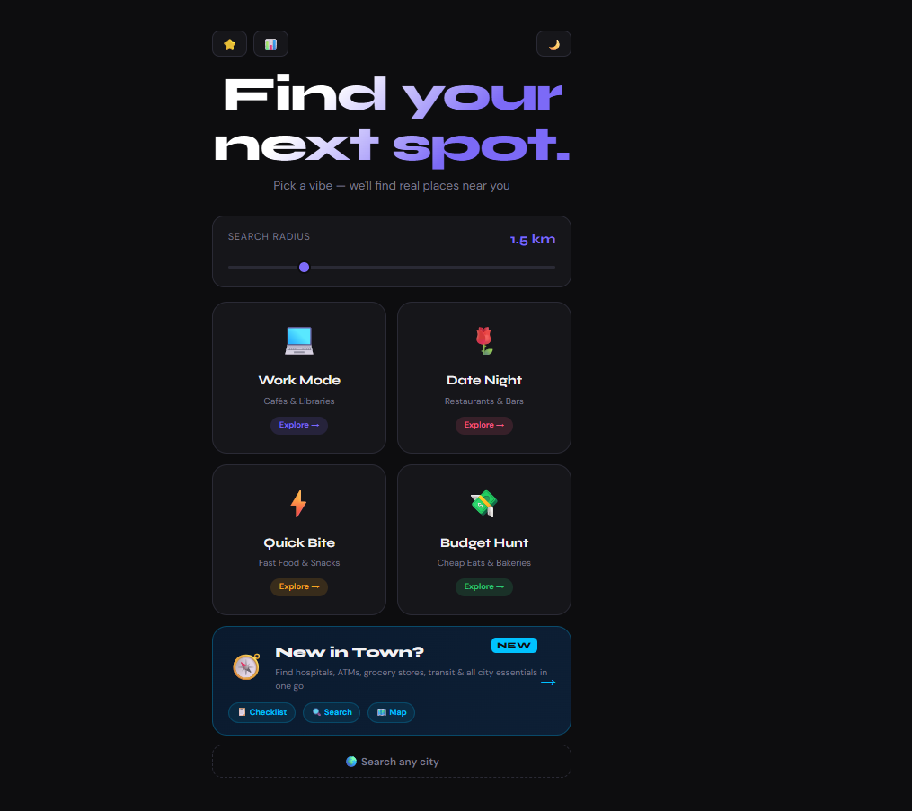
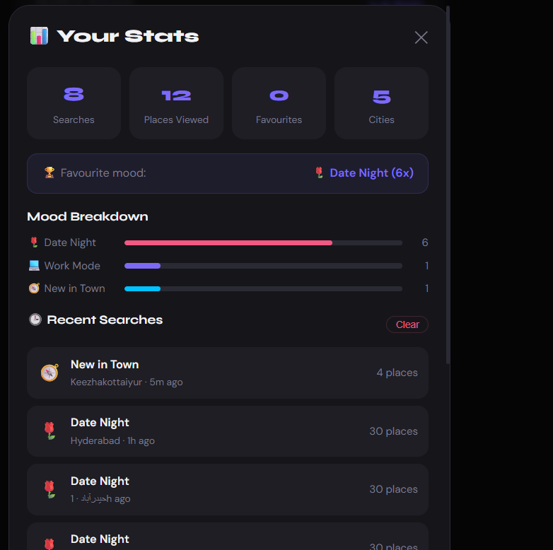
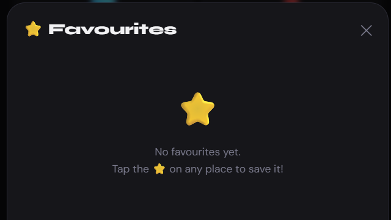

# 📍 Nearby Vibes — Smart Place Recommender

> A location-based place recommendation app built with React, Leaflet.js and OpenStreetMap's Overpass API. Pick a mood → get real nearby places instantly.


---

## 🎥 Demo


> Pick a mood → Allow location → See real nearby places on an interactive map

---

## ✨ Features

### 🎭 Mood-Based Search
| Mood | Places Found |
|------|-------------|
| 💻 Work Mode | Cafés, Libraries, Coworking spaces |
| 🌹 Date Night | Restaurants, Bars, Lounges |
| ⚡ Quick Bite | Fast Food, Food Courts |
| 💸 Budget Hunt | Cheap Eats, Bakeries |
| 🧭 New in Town | All City Essentials |

### 🗺️ Map & Navigation
- Interactive Leaflet map with custom numbered markers
- Route line drawn between your location and selected place
- One-click **Open in Google Maps** for walking/driving directions
- Auto-fit map bounds to show all results

### 📋 New in Town Mode
- **City Essentials Checklist** — Hospital, Pharmacy, Police, ATM, Grocery, Transit, Post Office, Restaurant
- Tick off each essential as you find it with a progress bar
- **Keyword Search** — type anything like "SBI ATM" or "Apollo Hospital"
- Quick search suggestions built in

### ⭐ Favourites & History
- Save any place to favourites — persisted in localStorage
- Recently visited history auto-recorded
- Stats Dashboard — total searches, mood breakdown, cities visited

### 🔍 Smart Search
- **City Search** — search any city worldwide, not just current location
- **Auto-widen radius** — if no results found, automatically retries at 5km then 10km
- Filter by **Open Now**, sort by **Nearest** or **Top Rated**

### 🎨 UI/UX
- 🌙 Dark / ☀️ Light mode toggle — preference saved
- 📤 Share any place via WhatsApp or copy to clipboard
- 📍 Custom emoji favicon
- Fully responsive — works on mobile and desktop
- Local language place names shown when available (Hindi, Tamil, Telugu)

---

## 🛠️ Tech Stack

| Category | Technology |
|----------|-----------|
| **Frontend** | React 18, JavaScript ES6+ |
| **Map** | Leaflet.js, React-Leaflet |
| **Map Tiles** | OpenStreetMap |
| **Places Data** | Overpass API (OpenStreetMap) |
| **Geocoding** | Nominatim API |
| **HTTP Client** | Axios |
| **Location** | Browser Geolocation API |
| **Storage** | localStorage |
| **Fonts** | Syne, DM Sans (Google Fonts) |

> 💡 **Zero API cost** — All APIs used are completely free with no key required.

---

## 📁 Project Structure

```
nearby-recommender/
│
├── public/
│   ├── index.html
│   └── manifest.json
│
├── src/
│   ├── App.js                      # Main app — screens & state management
│   ├── App.css                     # Global styles with dark/light theme
│   ├── index.js                    # React entry point
│   ├── index.css                   # Base reset
│   │
│   ├── components/
│   │   ├── MoodSelector.js/css     # Home screen mood cards
│   │   ├── MapView.js/css          # Leaflet map with markers & routes
│   │   ├── PlaceCard.js/css        # Place card with fav/share/route actions
│   │   ├── SearchBar.js/css        # Keyword search with suggestions
│   │   ├── EssentialsChecklist.js/css  # New in Town checklist
│   │   ├── CitySearch.js/css       # Search any city via Nominatim
│   │   ├── FavouritesPanel.js/css  # Saved places panel
│   │   └── StatsDashboard.js/css   # Usage stats & history
│   │
│   ├── services/
│   │   └── placesAPI.js            # All Overpass & Nominatim API calls
│   │
│   └── utils/
│       ├── filters.js              # Haversine distance, sort, star rating
│       └── storage.js              # localStorage helpers for favs/stats
```

---

## 🚀 Getting Started

### Prerequisites
- Node.js 16+
- npm or yarn

### Installation

```bash
# Clone the repo
git clone https://github.com/YOUR_USERNAME/nearby-vibes.git

# Navigate into project
cd nearby-vibes/nearby-recommender

# Install dependencies
npm install

# Start development server
npm start
```

Open [http://localhost:3000](http://localhost:3000) in your browser.

### Build for Production

```bash
npm run build
```

---

## 🌐 How It Works

```
User picks a Mood
       ↓
Browser Geolocation API → GPS coordinates
       ↓
Overpass API query built dynamically
e.g. node["amenity"="cafe"](around:1500, lat, lon)
       ↓
Raw OpenStreetMap nodes returned
       ↓
Client-side mapping:
  name · type · distance (Haversine) · rating · open status
       ↓
Leaflet map renders with custom markers
       +
Sidebar list with filter / sort
       +
Detail panel on click
```

---

## 📸 Screenshots

| Home Screen | Map View | New in Town |
|-------------|----------|-------------|
|  |  |  |

| Dark Mode | Stats Dashboard | Favourites |
|-----------|----------------|------------|
|  |  |  |

---

## 🔧 Key Implementation Details

### Haversine Formula
Used to calculate real-world distance between two GPS coordinates client-side:
```js
function haversine(lat1, lon1, lat2, lon2) {
  const R = 6371e3;
  const toR = d => d * Math.PI / 180;
  const dLat = toR(lat2 - lat1), dLon = toR(lon2 - lon1);
  const a = Math.sin(dLat/2)**2 +
            Math.cos(toR(lat1)) * Math.cos(toR(lat2)) * Math.sin(dLon/2)**2;
  return R * 2 * Math.atan2(Math.sqrt(a), Math.sqrt(1-a));
}
```

### Dynamic Overpass Query
Mood-based queries are built dynamically:
```js
const query = `
  [out:json][timeout:15];
  (
    node["amenity"="cafe"](around:${radius},${lat},${lon});
    node["amenity"="library"](around:${radius},${lat},${lon});
  );
  out body 40;
`;
```

### Auto-Widen Radius
If no results found, automatically retries with larger radius:
```js
let results = await fetchPlaces(lat, lon, mood, 1500);
if (results.length === 0) results = await fetchPlaces(lat, lon, mood, 5000);
if (results.length === 0) results = await fetchPlaces(lat, lon, mood, 10000);
```

---

## 🗺️ APIs Used

| API | Purpose | Cost |
|-----|---------|------|
| [Overpass API](https://overpass-api.de) | Fetch real POI data from OpenStreetMap | Free |
| [Nominatim](https://nominatim.openstreetmap.org) | City geocoding & reverse geocoding | Free |
| [OpenStreetMap Tiles](https://www.openstreetmap.org) | Map tile rendering | Free |
| Browser Geolocation API | User GPS coordinates | Built-in |

---

## 📝 Resume Line

> *Built a location-based recommendation app using React, Leaflet.js and OpenStreetMap's Overpass API. Features mood-based place discovery, real-time GPS, interactive maps with custom markers, dynamic filtering, keyword search, favourites, stats dashboard and a city essentials checklist — zero API cost.*

---

## 🤝 Contributing

Pull requests are welcome! For major changes, please open an issue first.

---

## 📄 License

MIT © 2026 — [ankitnegi-dev](https://github.com/ankitnegi-dev)

---

<p align="center">Built with ❤️ using React & OpenStreetMap</p>
